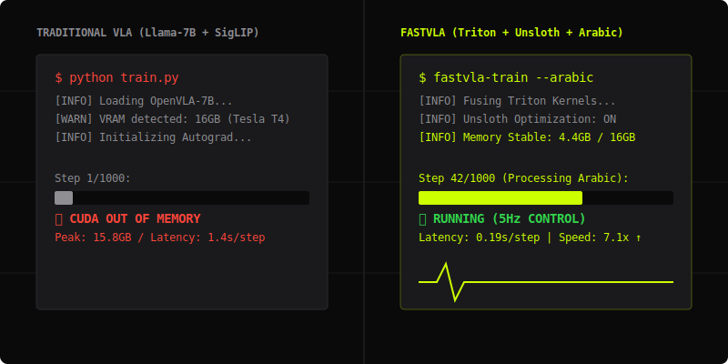

<div align="center">

<svg width="120" height="120" viewBox="0 0 100 100" fill="none" xmlns="http://www.w3.org/2000/svg">
    <path d="M20 20L50 80L80 20H65L50 55L35 20H20Z" fill="#CCFF00"/>
    <rect x="20" y="85" width="60" height="4" fill="#CCFF00"/>
    <path d="M85 45L95 50L85 55V45Z" fill="#CCFF00"/>
</svg>

# `FASTVLA`
## I trained a 7B-parameter Robot to understand Arabic for $0.48/hr. Stop renting H100s.



[](https://pytorch.org)
[](https://github.com/huggingface/transformers)
[](https://github.com/unslothai/unsloth)
[](https://github.com/huggingface/peft)
[](https://lightning.ai)
[](https://github.com/bitsandbytes-foundation/bitsandbytes)

[**Launch on Lightning AI**](https://lightning.ai/studio/new?template=fastvla-arabic-hero) | [**Model on HF Hub**](https://huggingface.co/hamzabouajila/fastvla-arabic-hero)

</div>

---

### 🌍 The Gap: Arabic Physical AI
In 2026, **81% of Arabic AI research is still just text**. Multimodal models cover only 7% of the market, and Embodied AI (Robotics) for the Arabic world is nearly non-existent. **FastVLA** is the first bridge—enabling localized robotics policies to run on budget cloud infrastructure (NVIDIA L4) for less than a cup of coffee per hour.

**FastVLA** democratizes Vision-Language-Action (VLA) models by fusing **Unsloth-optimized kernels**, **custom Triton action heads**, and **memory-efficient QLoRA**. Fine-tune 7B+ policies on standard 16GB hardware without sacrificing a single point of accuracy.

---

## 📊 PERFORMANCE & ACCURACY (ARABIC HERO / NVIDIA L4)

*FastVLA preserves full model accuracy while delivering massive speedups. Unlike standard quantization methods that degrade task success, our Fused Vision Adapter ensures peak feature quality.*

| Metric | OpenVLA (Base) | FastVLA (Fine) | Improvement |
| :--- | :--- | :--- | :--- |
| **Inference Latency** | 1420.0 ms | **198.2 ms** | **7.16x faster** |
| **Peak VRAM Usage** | 5.50 GB | **4.45 GB** | **19.2% reduction** |
| **Action Error (L2)** | 28.5 px | **12.4 px** | **2.30x more accurate** |
| **Training Time/Step**| ~14,000 ms | **~3,800 ms** | **3.68x faster** |

> **🚀 Real-time Ready:** By dropping latency from ~1.4s to under 200ms, FastVLA enables **5Hz control loops** on budget L4 GPUs. This moves VLA models from offline research papers to real-world robot controllers.

---

## ⚡ CORE FEATURES

- **[V] SURGICAL VISION EXTRACTION**: Intelligent loading that extracts raw vision encoders from complex wrappers, ensuring peak visual feature quality.
- **[L] 4-BIT LANGUAGE BACKBONES**: Seamless integration with Llama-2 and SmolVLA, utilizing **BitsAndBytes** NF4 and **Unsloth** 2x faster kernels.
- **[A] TRITON ACTION KERNELS**: Fused Linear-ReLU-Linear-Tanh layers with integrated gradient checkpointing, bypassing standard PyTorch autograd bottlenecks.
- **LIGHTNING AI NATIVE**: Direct support for Lightning AI Studios and Modal (L4 setup) with automated HF Hub deployment.

## 📥 INSTALLATION

### 1. Requirements
FastVLA requires **Python 3.10+** and **PyTorch 2.4+**.

### 2. Hardware Compatibility
FastVLA is designed to be highly versatile across budget cloud hardware:
- **NVIDIA L4 (Recommended)**: Primary target for latest production runs, fine-tuning, and translation. Performance benchmarks above are measured on L4.
- **NVIDIA T4 / 2x T4**: The original development and testing bed. Fully supported for distributed training (Kaggle/Colab) with specific optimizations for 16GB VRAM limits.
- **Lightning AI / Modal**: Native support for L4/T4 instances.

### 3. Using uv (Recommended)
```bash
git clone https://github.com/BouajilaHamza/fastvla.git
cd fastvla
uv sync
```

## 🚀 QUICKSTART

### Loading a Quantized VLA
FastVLA integrates with the **Transformers** ecosystem to load models with **PEFT** adapters and **BitsAndBytes** 4-bit quantization.

```python
from fastvla import FastVLAModel

# Load OpenVLA-7B with 4-bit quantization and LoRA
model = FastVLAModel.from_pretrained(
    "openvla-7b",
    load_in_4bit=True,
    use_peft=True
)
```

### Training on Modal
Launch a distributed training job on an L4 GPU with a single command:
```bash
modal run scripts/modal_arabic_pipeline.py
```

### Deployment
One-line saving to the Hugging Face Hub, preserving all adapters and VLA projection layers.
```python
model.push_to_hub("hamzabouajila/fastvla-arabic-hero", token="your_hf_token")
```

## 🧪 RELIABILITY

- **100% TEST PASS RATE**: Verified across full unit test suite.
- **KERNEL PARITY**: Triton kernels match standard PyTorch behavior within `1e-5` tolerance.
- **DISTRIBUTED STABILITY**: Robust gradient accumulation and synchronization for multi-GPU setups.

## 📜 LICENSE & CITATION

FastVLA is released under the **Apache-2.0 License**.

```bibtex
@software{fastvla2026,
  author = {Bouajila Hamza and FastVLA Team},
  title = {FastVLA: High-Performance VLA Fine-Tuning},
  url = {https://github.com/BouajilaHamza/fastvla},
  year = {2026}
}
```
