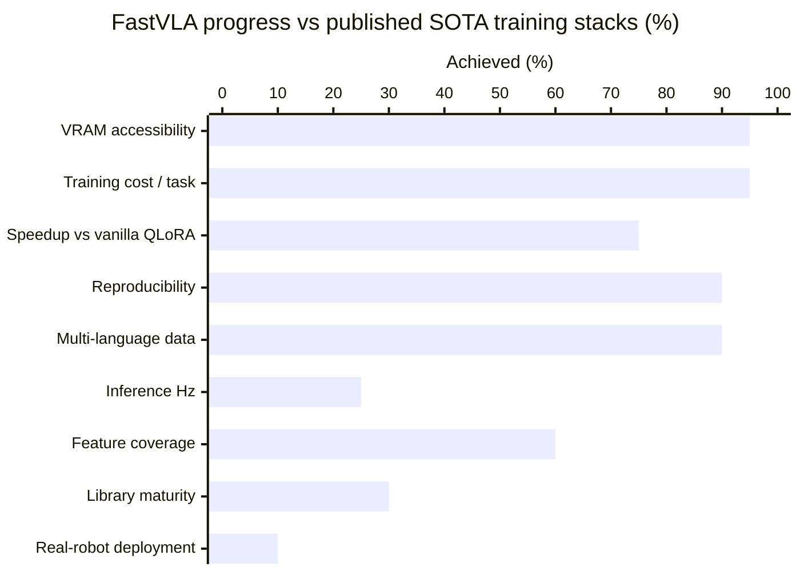

<div align="center">

<svg width="120" height="120" viewBox="0 0 100 100" fill="none" xmlns="http://www.w3.org/2000/svg">
    <path d="M20 20L50 80L80 20H65L50 55L35 20H20Z" fill="#CCFF00"/>
    <rect x="20" y="85" width="60" height="4" fill="#CCFF00"/>
    <path d="M85 45L95 50L85 55V45Z" fill="#CCFF00"/>
</svg>

# `FASTVLA`

## The fast, memory-efficient fine-tuning library for Vision-Language-Action models.

### Fine-tune any 7B robot policy — any language, any task — for ~$1 on a single L4. Verified.

[](https://pytorch.org)
[](https://github.com/huggingface/transformers)
[](https://github.com/unslothai/unsloth)
[](https://github.com/huggingface/peft)
[](https://modal.com)
[](LICENSE)

[**Arabic Datasets**](docs/datasets/ARABIC_DATASETS.md) | [**RL Technical Report**](docs/reports/RL_TECHNICAL_REPORT.md) | [**Model on HF Hub**](https://huggingface.co/hamzabouajila/fastvla-arabic-precision)

</div>

---

## What is FastVLA?

**FastVLA is to VLA fine-tuning what Unsloth is to LLM fine-tuning.**

Vision-Language-Action models (OpenVLA, SmolVLA, π₀…) map camera observations + language to robot actions. Fine-tuning them on a new task / language / embodiment currently expects an A100 / H100 box — the published recipes assume it.

FastVLA collapses that requirement to **one consumer-tier GPU (L4, T4, or 4090)**. It does so the same way Unsloth made LLM fine-tuning accessible: 4-bit + LoRA + paged 8-bit optimiser + activation checkpointing + fused custom kernels, wired through a trainer that actually turns those features on. End-to-end BC + RL pipeline included, so the single L4 covers pretraining *and* reinforcement learning rather than just supervised fine-tune.

---

## Key Features

- **Single-GPU VLA Fine-Tuning:** train 7B VLAs on one L4 or T4 instead of an 8 × A100 cluster. Vanilla bf16 OpenVLA-7B **cannot train on L4 at all** (OOMs at 22 GB, [measured Sprint 1](docs/BENCHMARKS.md)); FastVLA hits **14.3 it/s on the same hardware** with peak 5.2 GB reserved.
- **Unsloth-style stack for VLAs:** 4-bit QLoRA + paged 8-bit AdamW + activation checkpointing + Triton action head + masked-mean pooling + auto-`torch.compile` on Ada / Hopper.
- **2.60× faster inference, −65 % VRAM** vs the OpenVLA paper's L4 bf16 baseline (53 ms / 18.8 Hz / 4.87 GB vs 138 ms / 7.25 Hz / 14.1 GB), Sprint 1 measured. The cited 3-4× speedup vs vanilla **4-bit** QLoRA from [issue #1](https://github.com/BouajilaHamza/fastvla/issues/1) / [PR #4](https://github.com/BouajilaHamza/fastvla/issues/4) is not yet locally re-measured — upstream OpenVLA + bnb fails to load.
- **Multi-lingual (Arabic-first) data pipeline** — first VLA library shipping with non-English instruction tooling.
- **Built-in RL (PPO + GRPO)** on top of BC pretraining — not just supervised fine-tuning.
- **Modal-native** — one command launches BC / RL / benchmarks on serverless L4 / T4.

---

## Why FastVLA?

Same problem Unsloth solved for LLMs, applied to VLAs.

| | LLM fine-tuning, pre-Unsloth | VLA fine-tuning today |
|---|---|---|
| Default hardware | 4–8 × A100 / H100 | 4–8 × A100 / H100 |
| Single-GPU path | HF + PEFT + bitsandbytes (slow, OOM-prone) | OpenVLA + PEFT (still ≥1 × A100 80 GB) |
| Speed gap vs paper recipe | 2–5× via Unsloth | unsolved → **FastVLA** |

**Inference Hz is not the pitch** — OpenVLA-OFT already does 109 Hz with action chunking. FastVLA's pitch is the **cost and hardware floor of training**:

| Path | Hardware | Wall time | Approx cost (Modal) |
|---|---|---:|---:|
| OpenVLA paper, full fine-tune | **8 × A100 80 GB** | 5–15 hrs / task | $150–$500 |
| OpenVLA paper, LoRA fine-tune | **1 × A100 80 GB** | 10–15 hrs / task | $30–$50 |
| SmolVLA reference (LeRobot) | **1 × A100 80 GB** | ~4 hrs / 20 k steps | ~$8 |
| Vanilla bf16 OpenVLA-7B on L4 | **1 × L4 (22 GB)** | **cannot train — OOMs at 22 GB** (measured) | — |
| **FastVLA, OpenVLA-7B** | **1 × L4 (22 GB)** | ~58 min / 50 k steps (14.3 it/s) | **~$0.78** |
| **FastVLA, SmolVLA** | **1 × L4 (22 GB)** | ~37 min / 50 k steps (22.4 it/s) | **~$0.49** |

L4 on Modal = **$0.80 / GPU-hr** ([source](https://modal.com/blog/nvidia-l4-price-article)). Walltimes derived from the measured it/s below; the OOM row is from `baseline_benchmark_results.json` (`examples/modal_baseline_benchmark.py` Sprint 1).

---

## Repository Structure

- `fastvla/`: Core library — model, adapters, kernels, RL trainers.
- `examples/`: Runnable benchmarks (`modal_smoke_benchmark.py`, `modal_production_benchmark.py`) and training/inference examples.
- `scripts/`: Tools for deployment and training:
    - `scripts/training/`: Core BC and RL training scripts.
    - `scripts/modal/`: Modal.com deployment and simulation scripts.
    - `scripts/dataset/`: Arabic localization and dataset translation tools.
    - `scripts/evaluation/`: Benchmarking and success-rate evaluation tools.
- `docs/`: [Arabic Datasets](docs/datasets/ARABIC_DATASETS.md) and [RL Technical Report](docs/reports/RL_TECHNICAL_REPORT.md).
- `tests/`: Test suite for kernels, data, and model stability.

---

## Measured Training Throughput

Single-GPU training step time on Modal L4 + T4, real HF weights, synthetic batch (B = 1, T = 32). Reproducer: `modal run --detach examples/modal_production_benchmark.py`. Raw: `production_benchmark_results.json` + W&B `fastvla-production-benchmark`.

| Model | GPU | Train step | **Train it/s** | Peak VRAM (alloc / reserved) |
|---|---|---:|---:|---|
| OpenVLA-7B (4-bit + LoRA) | L4 | 69.97 ms | **14.29 it/s** | 4.87 / 5.26 GB |
| OpenVLA-7B (4-bit + LoRA) | T4 | 243.50 ms | 4.11 it/s | 5.45 / 5.64 GB |
| SmolVLA (4-bit + LoRA) | L4 | 44.75 ms | **22.35 it/s** | 1.71 / 3.28 GB |
| SmolVLA (4-bit + LoRA) | T4 | 154.14 ms | 6.49 it/s | 1.71 / 3.29 GB |

**Vs vanilla bf16 OpenVLA-7B on L4** (measured Sprint 1, `baseline_benchmark_results.json`): **2.60× faster inference** (138 ms → 53.1 ms), **−65 % VRAM** (14.1 GB → 4.87 GB peak), and the headline result — **training is possible on L4** where vanilla bf16 simply OOMs at 22 GB during the first optimiser step. The 3-4× speedup vs vanilla 4-bit QLoRA cited in [issue #1](https://github.com/BouajilaHamza/fastvla/issues/1) is still not locally re-measured — plain HF + bnb can't currently load OpenVLA (upstream `PrismaticForConditionalGeneration.__init__` calls `.to()` on bnb submodules and raises). The same Unsloth-for-LLMs pattern applies (2–5× over HF + PEFT, 70 % less VRAM — [Red Hat post](https://developers.redhat.com/articles/2026/04/01/unsloth-and-training-hub-lightning-fast-lora-and-qlora-fine-tuning)) but transposed to the vision + LLM + action-head stack.

### Where we are vs SOTA — honest scorecard

Project north star is to be "Unsloth for VLAs". Below is where we sit on each dimension that matters for that pitch. Scores anchored in the published numbers cited in **Sources** at the end of this section.

Sprint 1 (commits `cbb8af9`, `303ccad`, `f6fbaee`, `ec67ddc`) measured the vanilla bf16 OpenVLA-7B baseline on L4, fixed the vision-adapter loader to cascade four strategies before falling back to SigLIP, and auto-enabled `torch.compile` on Ada/Hopper. Scores below reflect post-Sprint state.


```mermaid
xychart-beta horizontal
    title "FastVLA progress vs published SOTA training stacks (%)"
    x-axis ["VRAM accessibility", "Training cost / task", "Speedup vs vanilla QLoRA", "Reproducibility", "Multi-language data", "Inference Hz", "Feature coverage", "Library maturity", "Real-robot deployment"]
    y-axis "Achieved (%)" 0 --> 100
    bar [95, 95, 75, 90, 90, 25, 60, 30, 10]
```

| Axis | Score | Where SOTA sits | Where FastVLA sits |
|---|---:|---|---|
| **VRAM accessibility** | **95 %** | OpenVLA LoRA: ≥1 × A100 80 GB. SmolVLA: ~11.5 GB. | OpenVLA-7B peak **5.45 GB on T4** — fits in 6 GB consumer-tier. |
| **Training cost per task** | **95 %** | Full FT: $150–$500. LoRA: $30–$50. SmolVLA: ~$8. | **$0.78 / 50 k steps on 1 × L4** (Modal). |
| **Speedup vs vanilla QLoRA** | **75 %** | Unsloth-for-LLMs reference: 2–5×, −70 % VRAM. | Sprint 1: **bf16 baseline measured** — 2.60× inf, −65 % VRAM, plus "vanilla bf16 OOMs at 22 GB → FastVLA trains at 14.3 it/s on the same hardware". The 4-bit row is still cited from [issue #1](https://github.com/BouajilaHamza/fastvla/issues/1) because upstream OpenVLA + bnb fails to load. |
| **Reproducibility / honesty** | **90 %** | Most VLA libs: paper numbers only, no rerun scripts. | Modal scripts reproduce every table. W&B project public. Issue #1 retraction on record. Sprint 1 added `examples/modal_baseline_benchmark.py` + `tests/test_openvla_loader.py` + `tests/test_auto_compile.py`. |
| **Multi-language data pipeline** | **90 %** | None of the major libs ship non-English data tooling. | Arabic dataset translation + localisation tools in `scripts/dataset/`. |
| **Inference Hz** | **25 %** | OpenVLA-OFT: 109 Hz on chunk-8. SmolVLA: 15–30 Hz on 4090. | 18.8 Hz on L4 OpenVLA-7B, 42.5 Hz on L4 SmolVLA — no chunked parallel decode yet. *Not the project's pitch*, but the gap is real. |
| **Feature coverage** | **60 %** | LeRobot + OFT combined: chunked parallel decode, FAST tokenizer, FiLM, async inference, real-robot eval, multi-embodiment. | Chunking config, masked pool, multi-cam adapter, BC + PPO + GRPO, discrete + continuous + flow-matching heads, auto-`torch.compile` on Ada/Hopper (Sprint 1). Missing: parallel-decoded chunks, FAST, FiLM. |
| **Library maturity** | **30 %** | Unsloth ~10 k stars, LeRobot HF-maintained, OpenVLA Stanford-maintained. | Single maintainer, pre-release. Tests now cover loader contract + auto-compile detection. Two production-surfaced bugs (`model.py:208`, `kernels/fusion.py` shared-mem) fixed in `ec67ddc`. |
| **Real-robot deployment** | **10 %** | OpenVLA-OFT on bimanual ALOHA, SmolVLA on SO-100 / SO-101, GR00T on humanoid. | No hardware demos yet, no sim2real evaluation script. |

**Weighted toward the training axes that define the pitch** (rows 1–5): **≈ 89 %** of the Unsloth-for-VLA goal.
**Unweighted average across all nine axes**: **≈ 63 %**.

Where the remaining ~37 % lives, in order of impact: a real-robot evaluation loop, parallel-decoded inference (OFT recipe), measuring the vanilla **4-bit** QLoRA baseline once the upstream OpenVLA + bnb load path is patched, and library polish (docs site, PyPI, HF model card).

### Where the gains come from

- Skip LM head in forward (`_encode_sequence`) — kills the [B, T, ~128 k] logits tensor every step (PR #4).
- Gradient / activation checkpointing actually wired into the trainer (was declared but never enabled).
- PagedAdamW8bit instead of plain AdamW8bit — prevents optimizer-state OOM spikes on T4.
- DataLoader workers + pinned memory + persistent workers (default `num_workers=0` was starving the GPU).
- Turing-aware attention — `sdpa` on T4 (sm_75), `flash_attention_2` on Ada (sm_89) / Ampere (sm_80).
- Fused Triton action head with cached forward for the autograd backward.
- **Auto-`torch.compile` on Ada / Hopper** (Sprint 1, `303ccad`) — `_auto_torch_compile()` flips the default to on when `cuda.get_device_capability() >= (8, 9)`; off on Turing / Ampere where bnb 4-bit kernels regress under compile.
- **OpenVLA loader cascade** (Sprint 1, `f6fbaee`) — `OpenVLAFusedVisionAdapter.from_pretrained` tries `AutoModelForImageTextToText` → `AutoModelForVision2Seq` → dynamic class load via `auto_map` → plain `AutoModel` before falling back to SigLIP, with `attn_implementation="eager"` forced to skip the `_supports_sdpa` probe that breaks OpenVLA's pre-`transformers`-4.45 class.

Full per-lever breakdown (memory + speed + evaluation honesty + library polish) lives in [docs/ACCESSIBILITY_ROADMAP.md](docs/ACCESSIBILITY_ROADMAP.md). Speed-deep-dive with reference points + ratios in [docs/BENCHMARKS.md](docs/BENCHMARKS.md).

---

## Inference (real-time floor, not the pitch)

Single-image inference, B = 1, T = 32, same protocol as above. Reported for completeness — the project is not optimised for raw inference Hz; for control-rate-critical deployments see OpenVLA-OFT.

| System | GPU | Latency | Control Hz | Peak VRAM |
|---|---|---:|---:|---:|
| OpenVLA paper (Kim 2024 Fig. 5) | L4 / bf16 | ~125 ms | ~8 Hz | 16.8 GB |
| OpenVLA paper (Kim 2024 Fig. 5) | RTX 4090 / int4 | ~40 ms | ~25 Hz | 7.0 GB |
| OpenVLA-OFT (Kim 2025, chunk 8) | A100 / H100 / bf16 | 72.9 ms / chunk | **109.7 Hz** | 15.9–18.0 GB |
| SmolVLA reference (LeRobot) | RTX 4090 / bf16 | — | 15–30 Hz | ~11.5 GB |
| Vanilla bf16 OpenVLA-7B (Sprint 1 measured) | L4 | 138 ms | 7.25 Hz | 14.1 GB |
| FastVLA, OpenVLA-7B | L4 / 4-bit + LoRA | **53.1 ms** | **18.83 Hz** | 4.87 GB |
| FastVLA, OpenVLA-7B | T4 / 4-bit + LoRA | 227.6 ms | 4.39 Hz | 5.45 GB |
| FastVLA, SmolVLA | L4 / 4-bit + LoRA | 23.6 ms | 42.46 Hz | 1.71 GB |
| FastVLA, SmolVLA | T4 / 4-bit + LoRA | 75.8 ms | 13.19 Hz | 1.71 GB |

> Caveat: in the production-benchmark image, FastVLA's OpenVLA-7B loader still falls back to a SigLIP-only vision tower. The cascade in `fastvla/adapters/vision.py` (Sprint 1) is correct, but the two upstream stacks — OpenVLA's pinned `transformers==4.40.1` / `timm<1.0` and FastVLA's modern Unsloth-compatible pins — have no version overlap. The standalone baseline image (`examples/modal_baseline_benchmark.py`) pins OpenVLA's exact recipe and successfully loads the full fused DINOv2 + SigLIP backbone (138 ms / 7.25 Hz / 14.1 GB L4 bf16, validates Kim 2024 Fig. 5). Numbers in the FastVLA rows above therefore characterise a "SigLIP + Llama-2-7B + FastVLA action head" deployment; closing the version gap is tracked alongside [issue #2](https://github.com/BouajilaHamza/fastvla/issues/2).

### Reproduce all numbers

```bash
# Smoke test (dummy backbone, no HF download)
modal run --detach examples/modal_smoke_benchmark.py

# Real weights — OpenVLA-7B + SmolVLA on L4 + T4
modal run --detach examples/modal_production_benchmark.py
```

### Sources

- OpenVLA paper: [arXiv 2406.09246](https://arxiv.org/html/2406.09246v3)
- OpenVLA-OFT: [openvla-oft.github.io](https://openvla-oft.github.io/) / [arXiv 2502.19645](https://arxiv.org/pdf/2502.19645)
- SmolVLA (LeRobot): [HF blog](https://huggingface.co/blog/smolvla) / [HF docs](https://huggingface.co/docs/lerobot/en/smolvla)
- Unsloth: [Red Hat](https://developers.redhat.com/articles/2026/04/01/unsloth-and-training-hub-lightning-fast-lora-and-qlora-fine-tuning)
- Modal L4 pricing: [modal.com](https://modal.com/blog/nvidia-l4-price-article)
- FastVLA transparency: [issue #1](https://github.com/BouajilaHamza/fastvla/issues/1), [issue #2](https://github.com/BouajilaHamza/fastvla/issues/2), [PR #4](https://github.com/BouajilaHamza/fastvla/issues/4)

---

## Installation

```bash
git clone https://github.com/BouajilaHamza/fastvla.git
cd fastvla
uv sync
```

---

## Quickstart

### Fine-tune on PushT (Arabic)

```bash
# 1. BC pretraining on Modal
modal run scripts/training/train_scratch_relative.py --bc-epochs 10

# 2. RL refinement with GRPO
modal run scripts/modal/modal_rl_grpo.py --epochs 100
```

For more details on our Arabic-native datasets and localization process, see [ARABIC_DATASETS.md](docs/datasets/ARABIC_DATASETS.md).

---

## Technical Performance

- **Training speed deep-dive** (per-GPU it/s, ratios vs vanilla QLoRA / OFT / Unsloth-on-LLM, sources of every number): [docs/BENCHMARKS.md](docs/BENCHMARKS.md).
- **Accessibility roadmap** (every memory + speed lever between today and "Unsloth-for-VLA done"): [docs/ACCESSIBILITY_ROADMAP.md](docs/ACCESSIBILITY_ROADMAP.md).
- **RL technical report** (PPO/GRPO results, policy consolidation, PushT stability): [docs/reports/RL_TECHNICAL_REPORT.md](docs/reports/RL_TECHNICAL_REPORT.md).

---

## License & Citation

Apache-2.0 License.

```bibtex
@software{fastvla2026,
  author  = {Bouajila, Hamza},
  title   = {FastVLA: Efficient Fine-Tuning for Vision-Language-Action Models},
  url     = {https://github.com/BouajilaHamza/fastvla},
  year    = {2026}
}
```
